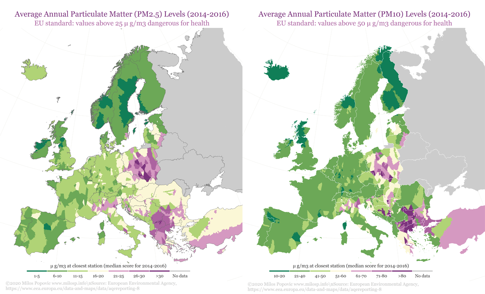
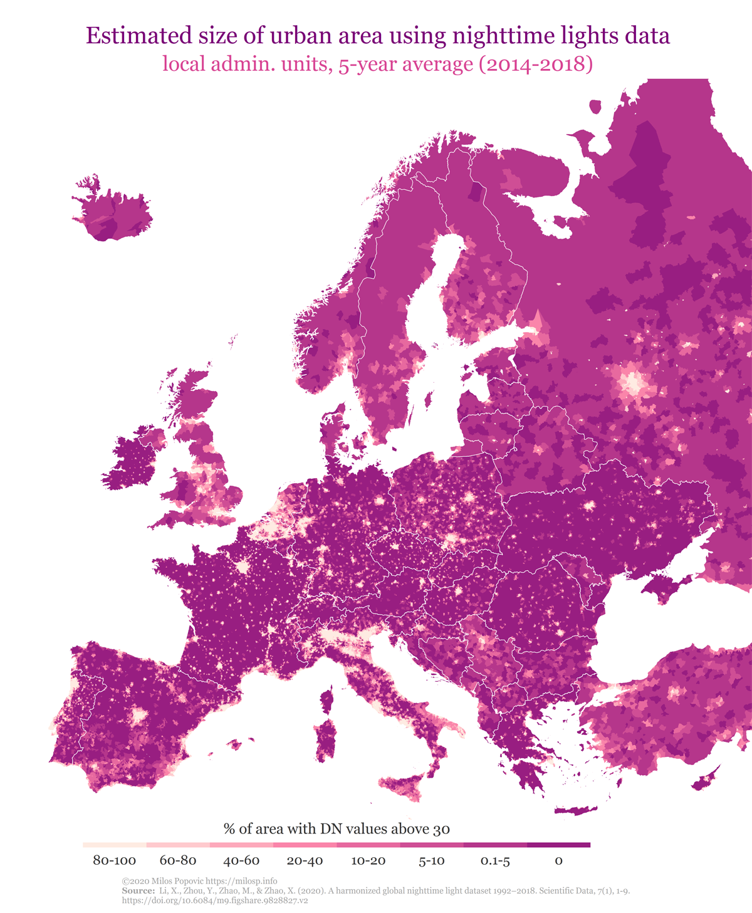
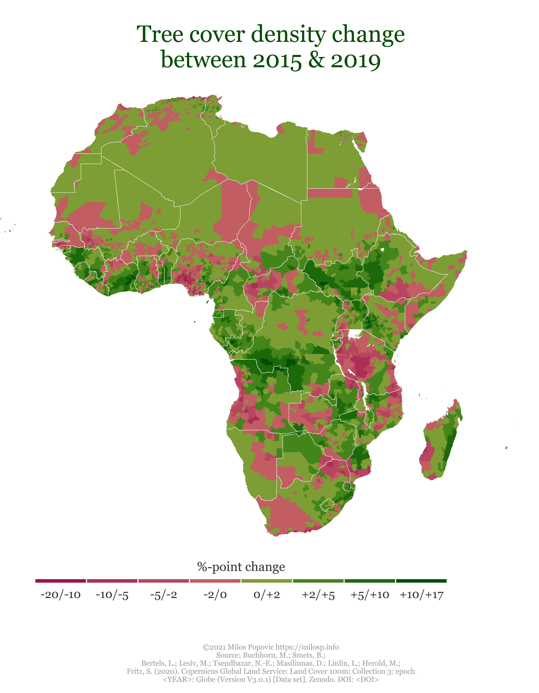

If you live in a polluted area, does it mean that you take climate
change seriously? Following the [Reprex Open Data Day
2021](https://reprex.nl/talk/reprex-open-data-day-2021/), we embarked on
a quest to explore this question using a unique combination of
micro-level data from Eurobarometer surveys, Eurostat’s sub-national
socio-economic data and satellite imagery from [European Environmental
Agency](https://www.eea.europa.eu/) (EEA) and NASA. Before venturing
forth into the forest of open data we, as all visual creatures out
there, first mapped the road ahead.

We used three sensory sources on pollution and deforestation, all of
which are closely related to environmental degradation, to create these
maps. In the first set of maps, we draw on EEA’s Air Quality
[e-Reporting
data](https://www.eea.europa.eu/data-and-maps/data/aqereporting-8) on
environmental pollution (particulate matter 2.5 and 10) for the period
2014–2016. What makes these data complex is their organization on the
level of the reporting stations. So, this means that we had to first
figure out the nearest aerial distance from every reporting station to
local administrative unit (LAU), assign the annual pollution levels to
every LAU and, finally, create our fine-grained map. Using this
approach, we are able to aggregate the data to any NUTS level and, with
help of the [retroharmonize](https://retroharmonize.dataobservatory.eu/)
and [regions](https://regions.dataobservatory.eu/) R packages, work with
public opinion and sub-national data to tackle our initial question.

Below you will notice that findings are constrained to countries for
which EEA commonly collects environmental data. Far from being
Euro-centric, our project is inclusive of other countries and continents
for which the pollution data is available – with the aforementioned
packages we could work with any nation’s or larger regions data. In
fact, we would like to invite contributors with greater knowledge of
reliable data sources from all continents.



Our joined dataset allows hypothesis testing on how much people’s
perception and attitudes to environmental degradation depends on the
quality of the environment that surrounds them.

In the next map, we go beyond the EU/EEA/EU candidate focus to depict
light pollution for the whole European continent. We used the
[Harmonized VIIRS nighttime light
data](https://figshare.com/articles/dataset/Harmonization_of_DMSP_and_VIIRS_nighttime_light_data_from_1992-2018_at_the_global_scale/9828827?file=17626079)
for 2014–2018, which is a novel open source with calibrated global
information on nightlight. This outstanding source offers an
unparalleled opportunity to measure the intensity of the socioeconomic
activities and urbanization. We showcase this in our map of estimated
average size of urban areas for every LAU using DN values higher than
30. This is a tip of an iceberg as our mapping capabilities may extend
to any available subnational data around the globe.

The VIIRS nighttime light dataset excels particularly in countries and
regions where GDP estimation and desagregation is patchy or
non-existent. We would like to find collaborators from Africa, the Arab
World, the Caucasus and Latin America, where we have harmonized,
individual level survey data and socio-econometric data, to join forces
with us to build relevant sub-national regional dictionaries for the
[regions](https://regions.dataobservatory.eu/) package, which can do the
rest of the work.

Nighttime lights are accurate predictors of local income, energy use and
contribution to carbon emissions.

In the final map, we use the [Copernicus Tree Cover
Density](https://land.copernicus.eu/pan-european/high-resolution-layers/forests/tree-cover-density)
dataset to compute how much deforestation has taken place on the LAU
level in Europe between 2015 and 2019. Using our regions package, these
data could easily be paired with public opinion and NUTS-level data to
analyze how deforestation influences individual attitudes on climate
change.

Deforestration is a key factor in carbon emission, because trees store
so much carbon. Any path to net zero carbon emission requires a vast
re-forestration of the Earth.

As we can see, in most of Europe deforestation is ongoing. This is
partly caused by effects of climate change, but partly further aggravate
the situation as the fallen trees release previously captured CO2. For
example, in Slovakia the Tatra mountains lost many trees in a
devastating storm; such extreme weather conditions kill vulnerable tree
cover, leading to soil errosion. Again, the Copernicus tree cover data
available for the entire Earth, and our
[regions](https://regions.dataobservatory.eu/) package only requires
local geocoding and geographical vocabulary additions to allow analysis
on almost all continents.

All this artwork barely scratches the surface of possibilities that
mapping sensoring data could offer to NGOs, think-tanks, small
enterprises as well as academic institutions. Most importantly, this
powerful approach could help these actors effectively link patterns in
environmental change to individual attitudes and subnational
socio-economic data.
